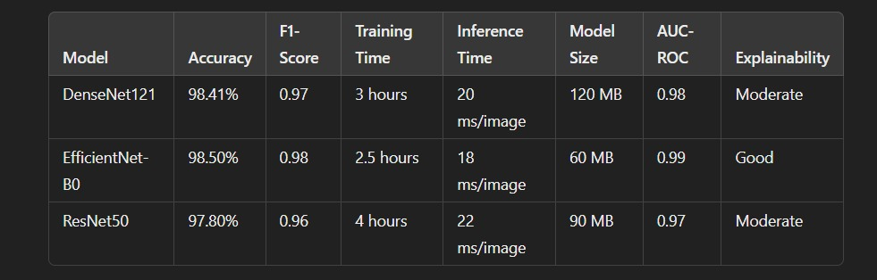
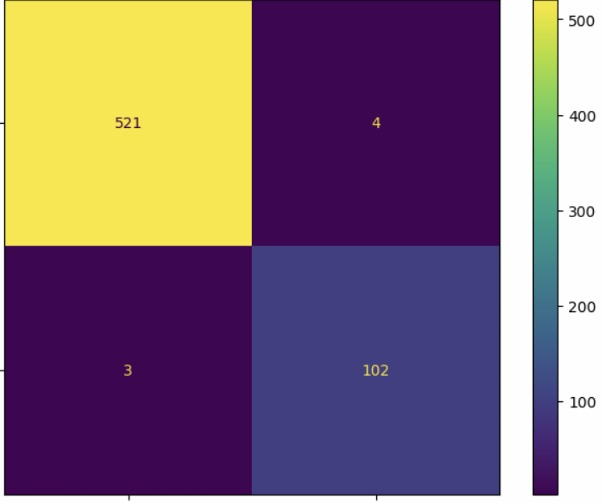
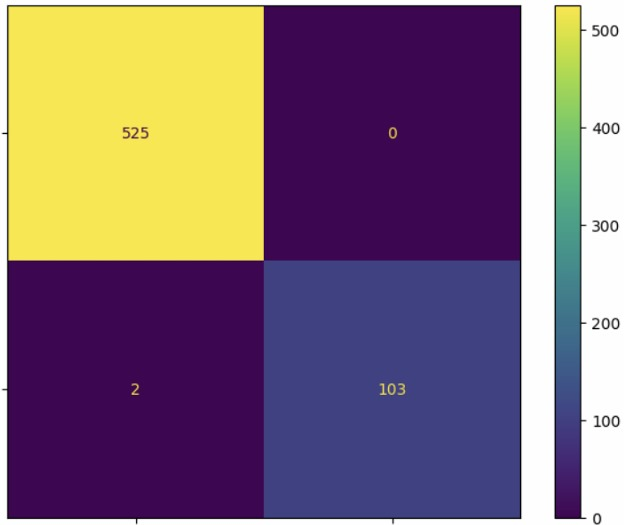

# DETECTION OF LUNG TUMOR USING CHEST XRAYS

Identification of lung tumour conditions through chest X-ray images processed by machine learning technology and associated methodology like CNN (ResNet50,DenseNet121,EfficientNet).

- Mortality: Over 500,000 deaths annually due to cancer in India.
- India accounts for 27% of global  cases (highest in the world).
 
# TESTING DIFFERENT CNN MODELS

3 CNN models were run and the efficiency's were compered in which EfficientNet performed the best 

# CONFUSION MATRIX FOR MODELS

- ResNet50

- DenseNet121

- EfficientNet 
